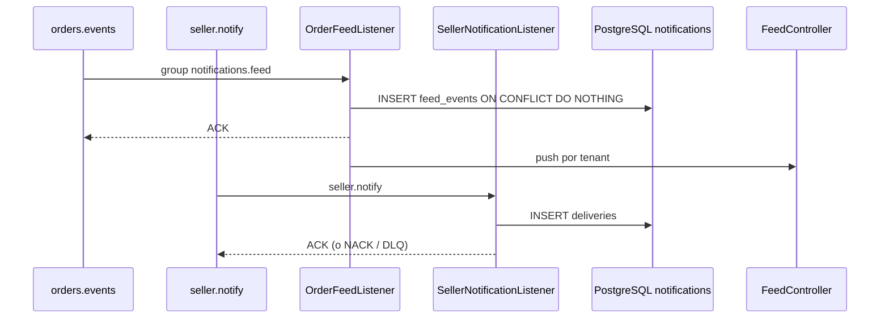
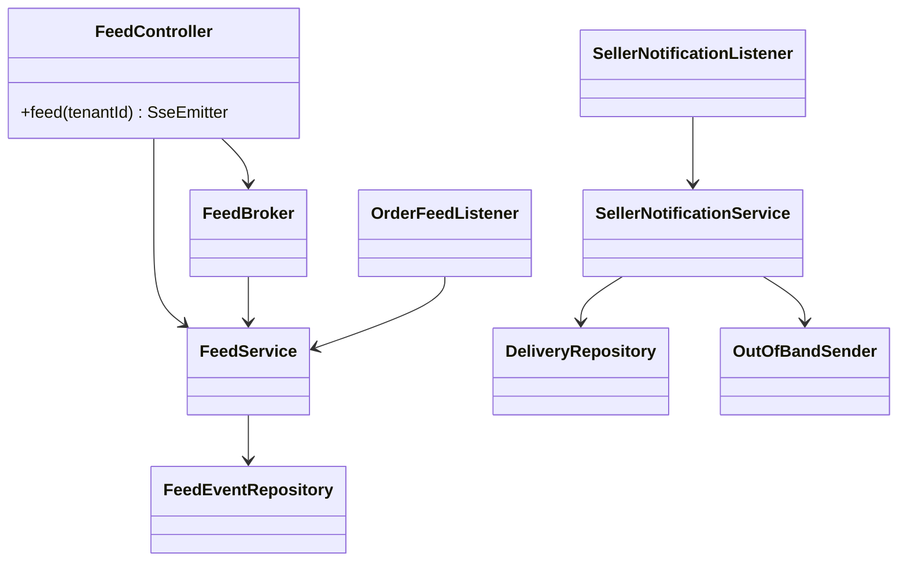

# UML 001 — Feed y notificación out-of-band

## Flujo

```mermaid
sequenceDiagram
  participant Kafka as orders.events
  participant Rabbit as seller.notify
  participant Feed as OrderFeedListener
  participant Notif as SellerNotificationListener
  participant DB as PostgreSQL notifications
  participant SSE as FeedController

  Kafka->>Feed: group notifications.feed
  Feed->>DB: INSERT feed_events ON CONFLICT DO NOTHING
  Feed-->>Kafka: ACK
  Feed->>SSE: push por tenant
  Rabbit->>Notif: seller.notify
  Notif->>DB: INSERT deliveries
  Notif-->>Rabbit: ACK (o NACK / DLQ)
```

## Estructura

```mermaid
classDiagram
  class FeedController {
    +feed(tenantId) SseEmitter
  }
  class FeedBroker
  class FeedService
  class FeedEventRepository
  class SellerNotificationService
  class DeliveryRepository
  class OutOfBandSender
  class OrderFeedListener
  class SellerNotificationListener

  FeedController --> FeedBroker
  FeedController --> FeedService
  FeedService --> FeedEventRepository
  FeedBroker --> FeedService
  OrderFeedListener --> FeedService
  SellerNotificationListener --> SellerNotificationService
  SellerNotificationService --> DeliveryRepository
  SellerNotificationService --> OutOfBandSender
```
